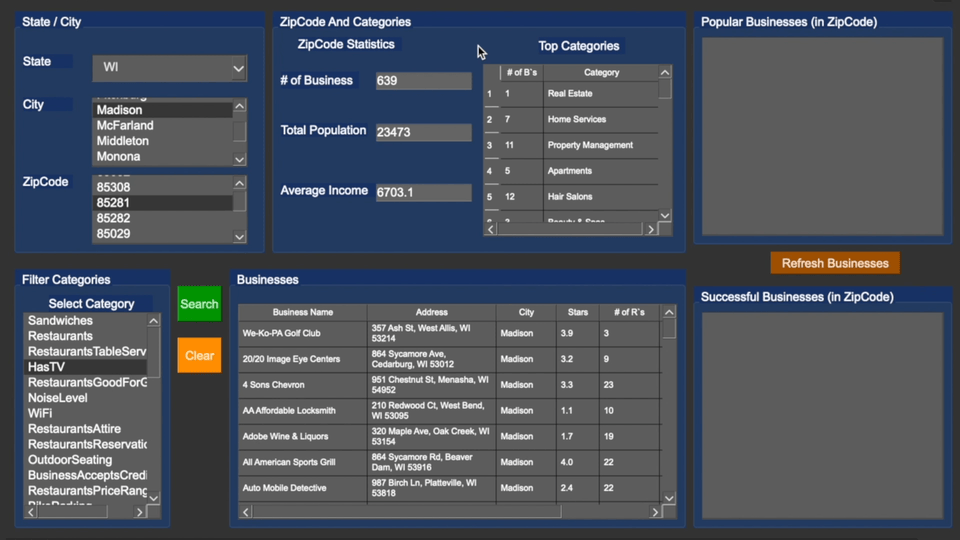

<h1 align="center">Yelp Database System</h1>

  

  

  

  

While learning about relational database management systems and database design theory, I developed a database infrastructure application that queries [Yelp.com's business review dataset](https://www.yelp.com/dataset) to extract useful information for local businesses and individual users.

Watch the Full Video Demo Here

---

# Table of Contents
- [What I Learned](#what-i-learned-in-this-project)
- [Tools Used / Development Environment](#tools-used--development-environment)
- [Team / Contributors / Teachers](#team--contributors--teachers)
- [How to Set Up](#how-to-set-up)
- [Project Overview](#project-overview)
- [Project Details](#project-details)
    - [Milestone 1](#milestone-1)
    - [Milestone 2](#milestone-2)
    - [Milestone 3](#milestone-3)
- [Implementation Details](#implementation-details)
- [Classification Paper](#classification-paper)
- [Results and Observations](#results-and-observations)
- [Future Work](#future-work)
- [Acknowledgments](#acknowledgments)

---

# What I Learned in this Project
- Database modeling and design
- Creating entity relationship (ER) diagrams
- Converting ER diagrams to DDL SQL statements for table creation
- Populating and Querying a database with large datasets
- Optimizing query performance through indexes
- JSON parsing
- Database Application Development using PyQT

# Tools Used / Development Environment
- Python
- SQL
- PgAdmin 4
- Postgres
- Wondershare EdrawMax for ER diagrams
- PyQT
- VS Code
- Terminal
- MacOS

# Team / Contributors / Teachers
- [Mitchell Kolb](https://github.com/mitchellkolb)
- Professor. Ananth Jillepalli
- Professor. Sakire Arslan Ay

# How to Set Up
This project was implemented on my macbook:
- Download the [Yelp.com's business review dataset](https://www.yelp.com/dataset) and extract it into the milestone folder you want to run the code in.
- This project only uses the business, checkin, user, and review dataset files.
- Clone this repository 
- Open terminal at the codebase `~.../yelp-database/milestone#/`
- Install postgreSQL database software like PgAdmin4 and Postgres to have a locally run database to connect to.
- Install python3, pyqt6, and psycopg2
- Add the credentials for your local postgreSQL instance into the codebase file.
- Run the  `.py` file of your choice

## Project Overview
I utilized PostgreSQL and PyQt to develop a data search application for Yelp.com’s business review data. The main point of this project was on the creation of the database infrastructure, involving JSON data parsing, designing and implementing a database schema, populating the database with large datasets, and querying the database to extract useful information for local businesses and users using premade or custom queries.

## Project Details

### Milestone 1
In Milestone 1, I focused on parsing the Yelp JSON data and developing a simple database application. This involved:
1. Downloading and understanding the Yelp dataset.
2. Creating a JSON parser to extract key-value pairs and store them in text files.
3. Designing a database schema and creating an ER diagram.
4. Translating the ER model into SQL DDL statements to create the necessary tables in PostgreSQL.
5. Developing a simple Python application to connect to the PostgreSQL database and run queries to list states, cities, and businesses.

### Milestone 2
In Milestone 2, I refined the database schema, figured out how to begin my custom queries for determining popular/successful business's, and developed the application further:
1. Revising the database schema to include attributes like `numCheckins` and `reviewRating`.
2. Translating the revised ER model into relations and producing DDL SQL statements.
3. Populating the database with Yelp data by generating and running INSERT statements.
4. Writing triggers to enforce additional constraints.
5. Developing the application GUI to allow users to interact with the database and retrieve information based on states, cities, zip codes, and business categories.

### Milestone 3
In Milestone 3, I completed the development of the full application:
1. Finalizing the database schema and ensuring it was fully populated with accurate data.
2. Implementing my custom queries to extract meaningful insights from the Yelp data like which businesses where the most popular.
3. Optimizing query performance through indexing.
4. Completing the user interface to provide a seamless experience for users to search and filter businesses based on various criteria.

## Implementation Details
The implementation involved several key steps:
1. **Database Design:** I created an ER diagram to model the database, which I then translated into SQL DDL statements to create tables in PostgreSQL.
2. **JSON Parsing:** I used Python scripts to parse JSON files and generate SQL INSERT statements to populate the database.
3. **GUI Development:** I used PyQt to develop the graphical user interface, allowing users to interact with the database and retrieve information easily.
4. **Optimization:** I created indexes to improve query performance and implemented triggers to maintain data integrity.

## Classification Paper
As part of Milestone 2, I wrote a paper to classify businesses as popular or successful based on the data from Yelp reviews. My proposed method for classification depended on three factors:
1. Definition of popular and successful.
2. Data available in the dataset.
3. Expanding on existing metrics described in the milestone instructions.

**Popular Businesses:** 
I defined a popular business as one that attracts more customers compared to others in the same category within a specific time span. Popularity doesn't necessarily mean high quality; it simply indicates a higher number of check-ins and reviews.

**Successful Businesses:** 
I defined a successful business as one that is financially positive, reviewed positively, and consistently delivers quality products. Successfulness involves having a high number of positive reviews and check-ins over time.

**Data and Metrics:**
My dataset included business, user, check-in, and review data. The review dataset was particularly useful because it contained various attributes like stars, HasTV, GoodForGroups, Wifi, reservations, outdoor seating, delivery, parking, style, and GoodForKids. I used these attributes, along with the quantity of restaurants in an area, to determine the popularity and success of a business.

To expand on the metrics for determining popularity, I included stars, review ratings, number of reviews, and the number of recent check-ins. For success metrics, I considered the most accommodations available, along with keywords in reviews such as popular, hub, place to be, successful, spend lots of money, and can’t wait to come back.

## Results and Observations
During development, I learned a lot about the Yelp data given to me and how to make the application perform smoothly with it. The application i created successfully allowed users to search for businesses, view details about them and filter results based on different criteria.

## Future Work
Future improvements could include:
1. Enhancing the user interface to provide more advanced filtering options.
2. Integrating more datasets to provide a richer context for business analysis.
3. Optimizing the application further to handle even larger datasets more efficiently.

--- 
# Acknowledgments
This codebase and all supporting materials was made as apart of a course for my undergrad at WSU for CPTS 451 - Introduction to Database Systems in the Spring of 2023. 

